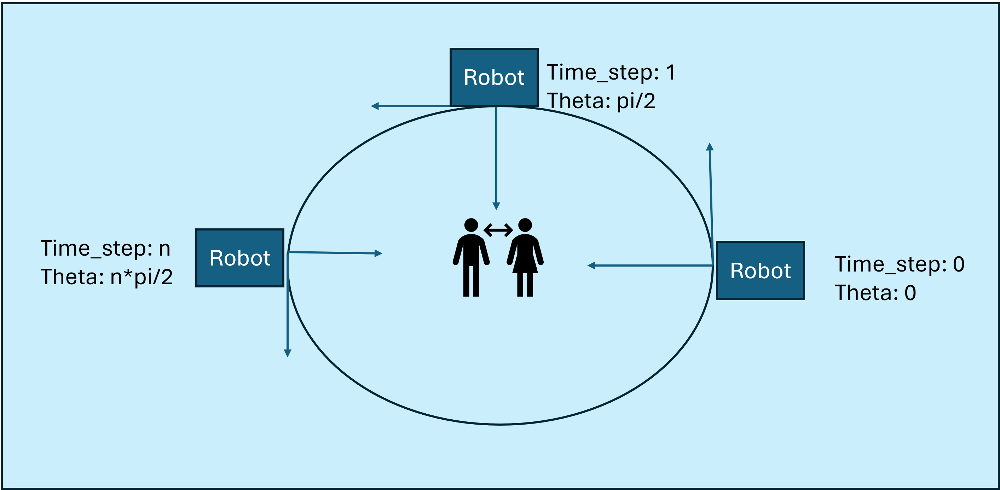

# How to run code

## 1. Create Conda Environment:

**conda env create -f environment.yml**

## 2. Activate Conda Environment:

**conda activate env**

## 3. Fine-Tune a model:

**Fine-tuning models are done with traning_script.py**
In this script users are able to chage the base_model variable with a HuggingFace Repo \n
to perform instruction fine-tuning on the Alpaca instruction datset (currently available in alpaca_data.json)

## Discussion:

**Project Motivation**
This repo serves as a jumping off point to train low-parameter models for detecting inappropriate actions. More specfically, interactions that occur in virtual space. As the proliferation of virtual reality (VR) technology continues to increase, there is a signifant concern that these technologies will become disproportionatly weaponized against at-risk populations, such as children. Therefore it is imperitive to counter act sexual harassment in children's VR games. Examples of this include, groping, sexually charged discussion from adults, and virtual rape. The focus of this exploratory project is to develop a submodle for the detection of virtual groping with a simple taxonomy that can be extended to low-parameters models to aid in this technologies adoption.

Here is potentially how the bot could be used in near-real-time to evaluated interactions during game play:

**Dataset Generation**

LLaVA models have shown great performance and generalization across many task. In fact, the LLaVA 1.6 34B parameter model showed incredible out-of-the-box performance on simple inferences about virtual environments, even though it was not explicitly trained primarily on this domain. In this work, we propose using the latest LLaVA 1.6 34B model to train a smaller model - LLaVA 1.5 7B. To do this, an image dataset was created in Unity3D. For this preliminary work, two interactions were depicted; 1.) Consensual interactions and 2.) Nonconsensual interaction. Then leveraging the simple taxonomy for determining virtual groping the LLaVA 1.6 was used to generate binary classifications of the images -a.) are they touching & b.) are they touching in an intimate area. These data was formatted as described by the original authors of the LLaVA models: [https://github.com/haotian-liu/LLaVA/blob/main/docs/Finetune_Custom_Data.md]

